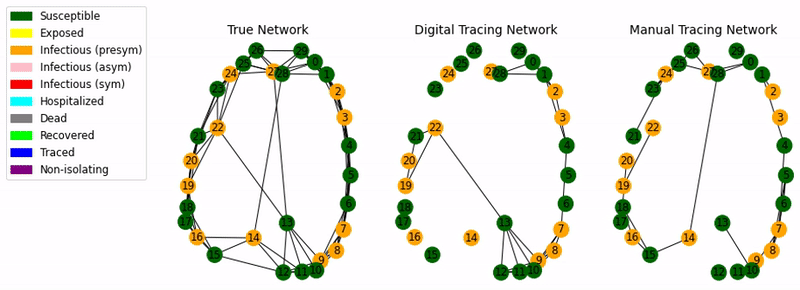
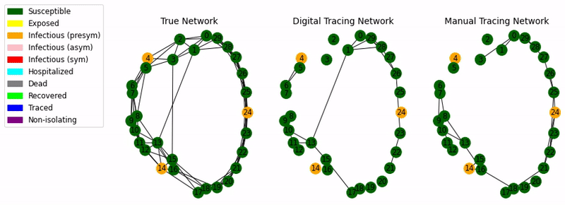

# SEIR-T: Model contact tracing for COVID-19

A <b>multi-site mean-field model</b> for studying the effects of different "test and trace" strategies on the spread of <b>COVID-19</b>. The infection spreads over the full network of contacts, whereas <b>each type </b> of tracing gets conducted over different subsets of that network (i.e. one for manual and one for digital tracing).

SEIR-T is a compartmental formulation that describes SARS-Cov-2 transmission and the corresponding contact tracing in terms of network-defined neighborhoods.

Link to original study: <a href="https://journals.plos.org/plosone/article?id=10.1371/journal.pone.0259969" target="_blank">Rusu et al., 2021</a>

<br />

<p style="text-align:center;"><a href="https://www.dropbox.com/s/m284tx8tmgeckqk/noncomp.mp4?dl=0" target="_blank"></a></p>


<i>Ineffective Manual + Digital Tracing </i>          |  <i>Efficient Manual + Digital Tracing </i>
:-------------------------:|:-------------------------:
[](https://www.dropbox.com/s/bxirlp1271teadg/nct.mp4?raw=1#t=0.1) |  [](https://www.dropbox.com/s/3o0a63ivj8gk82c/ct.mp4?raw=1#t=0.1)

<br />
<h2>Running example:</h2>

```
python ct_simulator/run_tracing.py \
    --netsize 1000 \
    --k 10 \
    --p .2 \
    --nettype "barabasi" \
    --multip 3 \
    --model "covid" \
    --dual 2 \
    --uptake .5 \
    --overlap .7 \
    --maintain_overlap False \
    --nnets 4 \
    --niters 4 \
    --separate_traced True \
    --avg_without_earlystop True \
    --trace_once False \
    --first_inf 1 \
    --earlystop_margin 2 \
    --rem_orphans True \
    --noncomp 0 \
    --presample 100000 \
    --pa .2 \
    --taut .1 \
    --taur .1 \
    --sampling_type "min" \
    --netseed 31 \
    --seed 11 > file.out
```

The API supports Python calls from Jupyter Notebooks, using the same arguments:
```python
from ct_simulator import run_tracing
kwargs = {
    'netsize':30, 'nettype':'barabasi', 'k':5, 'model':'covid', 'dual':2, 
    'uptake':.5, 'overlap':.7, 'taut':.1, 'taur':.1, 'animate':0.5,
}
run_tracing.run_api(**kwargs)
```

Additionally, the user can supply predefined networks via the <i>nettype</i> parameter:
```python
from ct_simulator import run_tracing
import networkx as nx
G = nx.fast_gnp_random_graph(30, p=.2, seed=5)
kwargs = {
    'nettype': G, 'model':'covid', 'dual':2, 
    'uptake':.5, 'overlap':.7, 'taut':.1, 'taur':.1, 'animate':0.5,
}
run_tracing.run_api(**kwargs)
```

It is also possible to study the disease progression over dynamic networks. In order to do so, <i>nettype</i> should be a dictionary mapping timestamps to tuples of edge sets, one for each network type (i.e. infection, digital tracing, manual tracing). Note that random subnetworks of the true contacts graph can also be generated (according to the <i>uptake</i> and <i>overlap</i> parameters), if the user only predefines the infection network.

```python
from ct_simulator import run_tracing
nettype = {
    'nid': range(10),
    '0': (
        [(1,3), (1,2), (1,5), (1,4), (2,3), (5,3)], 
        [(1,2), (2,3)], 
        [(1,5),(2,3)], [(1,3,7), (1,4,2)],
    ),
    '1': (
        [(0,1), (1,7), (0,5), (1,4), (2,5)], 
        [(5,2), (1,4)], 
        [(0,3), (2,5), (0,1)]
    ), 
    '2': ([(0,5), (1,4), (1,2)],[(4,1), (1,2)], [(1,2), (1,4)]),       
}
kwargs = {
    'nettype':nettype, 'model':'covid', 'dual':2, 'first_inf': 4, 
    'update_after':1, 'taut':.1, 'taur':.1, 'animate':0.5,
}
run_tracing.run_api(**kwargs)
```
<br />
<h2>Parameter descriptions:</h2>

```python
#### Network related parameters:
## network wiring type; this can be one of the following: 
# - a STR with the name of a random graph model (e.g. random, barabasi, ws, powerlaw-cluster) OR a predefined dataset (SocialEvol)
# - an Iterable of edges (including nx.Graph objects)
# - a DICT mapping integer timestamps (0,1,...) to LISTS of predefined networks - infection, tracing #1, tracing #2
# for DICT the 'update_after' param dictates when each integer key becomes 'active', thus changing the network wiring (dynamic)
'nettype': 'random',
## net size, avg degree, rewire prob, edge weighting switch for various graph types - these only have EFFECT IF nettype is a known nettype (STR type)
'netsize': 100, 'k': 10., 'p': .05, 'weighted': False,
# whether to reindex (starting from 0) the nids received as input from an external nettype or not
'reindex': False,
## controls whether edge weights matter for transmission and their normalising factor (only has effect when networks with edges have been provided)
'use_weights': False, 'K_factor': 10,  # if K_factor = 0, no normalization of weights happens
## 0 - tracing happens on same net as infection, 1 - one dual net for tracing, 2 - two dual nets for tracing
'dual': 1,
## overlaps for tracing nets (second is used only if dual == 2)
'overlap': .8, 'overlap_two': .5,
## if no overlap given, tracing net has zadd edges added on random, and zrem removed
'zadd': 0, 'zrem': 5, # if overlap is set, bool(zadd) is still used to infer whether we want to add random edges or only remove
## similar as before but for dual == 2 and if no overlap_two given
'zadd_two': 0, 'zrem_two': 5, # zadd_two fully replicates the functionality of zadd for the second dual net
## maximum percentage of nodes with at least 1 link (adoption rate)
'uptake': 1., 'uptake_two': 1.,
## if maintain_overlap True, then the generator will try to accommodate both the uptake and the overlap
'maintain_overlap': False, 'maintain_overlap_two': True,
## update network after X days
'update_after': -1,
## num of sampling edges (or uniform distrib limits for this num) to be used for a known nettype provided as STR
'edge_sample_size': [],
## controls type of edges subset sampling
'edge_prob_sampling': True,

#### Compartmental model parameters:
## can be sir, seir or covid
'model': 'sir',
## number of nodes infected at the start of sim
'first_inf': 1.,
## whether to have the Traced status separate from the infection states
# Note if this is disabled, much of the functionality surrounding noncompliance and self-isolation exit will not work
'separate_traced': True,
## whether Susceptible people are isolated 
# if True and 'traced', they can't get infected unless noncompliant
'isolate_s': True,
## whether to mark hospitalized as traced
'trace_h': True,
## if -1/None a node can become traced again only after exiting self-isolation
# not -1/None a node can become traced again after this amount of time (in days) has elapsed after becoming ilegally N
'trace_after': 7,
## percentage of contact reduction effect from possible edges, mask wearing and stay-at-home people
'contact_reduction': 0, 'mask_uptake': 0., 'sah_uptake': 0.,

#### Disease-specific parameters that are common for multiple models:
## transmission rate -> For Covid, 0.0791 correponding to R0=3.18
'beta': 0.0791,
## latency -> For Covid 3.7 days
'eps': 1/3.7,
## global (spontaneus) recovey rate -> For Covid 2.3 days
'gamma': 1/2.3,
## allow spontaneus recovery (for SIR and SEIR only, for Covid always true)
'spontan': False,
## recovery rate for traced people (if 0, global gamma is used)
'gammatau': 0,
## masks wearing transmission cut
'mask_cut': .5,

#### COVID model specific parameters:
## probability of being asymptomatic (could also be 0.5)
'pa': 0.2,
## relative infectiousness of Ip/Ia compared to Is (Imperial paper + Medrxiv paper)
'rel_beta': .5,
## relative random tracing (testing) rate of Ia compared to Is
'rel_taur': .8,
## duration of prodromal phase
'miup': 1/1.5,
## probability of being hospitalized (i.e. having severe symptoms Pss) based on age category
'ph': [0, 0.1, 0.2],
## If hospitalized, daily rate entering in R based on age category: children, adults, seniors
'lamdahr': [0, .083, .033],
## If hospitalized, daily rate entering in D based on age category: children, adults, seniors
'lamdahd': [0, .0031, .0155],
## Age-group; Can be 0 - children, 1 - adults, 2 - senior
'group': 1,
## Age-group percentages (to be used when no group is selected, i.e. takes a value of -1/None)
'group_percent': [.173, .641, .186],
## List of 3 elements that encode a change in viral variant:
# first element is factor change in the transmission rate; 
# second is factor change in the probability of hospitalization;
# third element is factor change in the death rate
'voc_change': [],
## time after which the hospitalization/death rates change due to another variant
# this should be an integer designating full days (it will be ignored if float)
'voc_after': 15,

#### Tracing parameters:
## testing (random tracing) rate
'taur': 0.,
## contact-tracing rates for first & second tracing networks (if exists)
'taut': 0.1, 'taut_two': -1.,
## number of days of delay on second tracing network compared to first one
# this is taken into account only if taut_two==-1/None
'delay_two': 2.,
## noncompliance rate; Note this ONLY works for args.separate_traced=True
# each day the chance of going out of isolation increases by x%
'noncomp': 0.,
## whether the noncomp rate gets multiplied by time difference t_current - t_trace
'noncomp_dependtime': True,
## period after which T becomes automatically N (nonisolating); Note this ONLY works for args.separate_traced=True
# -1/None means disabled; 14 is standard quarantine
'noncomp_after': -1,

#### Simulation controlling parameters
## running number of nets, iterations per net and events for each
# if nevents=0, run until no more events
'nnets': 1, 'niters': 1, 'nevents': 0,
## seed of simulation exponentials; the seed for network initializations; and the first infected seed
# if -1, both seed and netseed default to None, whereas infseed is ignored (and netseed gets used for sampling the first infected)
# except for infseed (and only in the case of a positive value), neither seed gets used directly, rather they get incremented by iterators
'seed': -1, 'netseed': -1, 'infseed': -1,
## 0 - no multiprocess, 1 - multiprocess nets, 2 - multiprocess iters, 3 - multiprocess nets and iters (half-half cpus)
'multip': 0,
## sampling procedure for events; can be either of these:
# dir: the exponential is sampled DIRECTLY from the function registered on the transition object
# each: the transition obj registers only the lambda rates, the exponential is sampled FOR EACH lambda with exp_sampler.py
# min: Gillespie's algorithm; the transition obj registers the lambda rates, ONLY the MINIMUM exponential is sampled based on sum
'sampling_type': 'min',
## number of stateless exponential presamples (if -1/None/0, no presampling)
'presample': -1,
## whether or not to remove orphans from the infection network (they will not move state on the infection net)
'rem_orphans': False,
## if rem_orphans, noising of links can be calculated either based on the full node list or the active nonorphan list through this param
'active_based_noising': False,
## wehther efforts are to be computed for each type of tracing (random+contact)
'efforts': False,
# agent-based simulation; if 0 EBM is run, otherwise ABM is run with minimal latent transition (sim_agent_based - 1) steps
'sim_agent_based': 0,

#### Summary/logging-related parameters
## controls how the program returns and what it prints at the end of the simulations
# -1/None -> always return None, summary never called; 0 -> return summary, no printing; 
# 1 -> return None, print json summary to stdout; 2 -> return None, print to file
'summary_print': -1.,
## how many time splits to use for the epidemic summary (if 0, no summary is computed)
'summary_splits': 30,
## number of days for Reff calculation
'r_window': 7,
## first_inf + earlystop_margin determines if a simulation is regarded as early stopped
'earlystop_margin': 0,
## used to calculate fraction of 'contained' epidemics (i.e. overall infected nodes smaller than fraction `alpha_contain`)
'alpha_contain': 0.4,
## whether alternative averages which have no early stopped iterations are to be computed
'avg_without_earlystop': False,
## an id for the experiment to be used by the logging folder structure
'exp_id': 'default_id',

#### Drawing- and printing-related parameters:
## controls printing information during the simulation and animation of the infection progress
# -1 - args printed; 0 - full printing, 1 - print nothing, FORCE animate, >1 - no print, no animation unless `draw`!=0 supplied
'animate': 0,
## 0 - no draw, 1 - draw at start/finish, 2 - draw and save figure at finish
'draw': 0,
## if not 0, draw after each iteration and sleep for this long
'draw_iter': 0.,
## drawing configuration: engine, layout, custom behavior for dual, labels etc.
'draw_config': {'plotter': 'default', 'layout': 'spring', 'legend': 0, 'with_labels': True,
                'output_path': 'fig/graph'},

#### Control-related parameters
## dict that is utilized to initialize a testing/tracing Agent
'agent': {},
## learning model for ranking nodes
'ranker': {},
## interface with a shared memory object across processes (copied over)
'shared': None,
## number of episodes, eps_start and eps_decay
'control_schedule': [],
## number of infected (or percent of the total infected) that the agent 'knows' about at the start of control; if <0, taken from infectious nodes only
'control_initial_known': .25,
## number of days that need to pass before the control routine is activated
'control_after': 5,
## number of infected (or percent of the total population) that needs to be surpassed until the control routine is activated
'control_after_inf': .05,
## corrections for CT simulations: 0 never, 1 all at once, 2 allow the controller to catch-up dynamically if unspent budget
'control_makeup_days': 2,
## vax immunity delay
'control_immunity_delay': 21,
## whether control uses GPUs
'control_gpu': False
```
